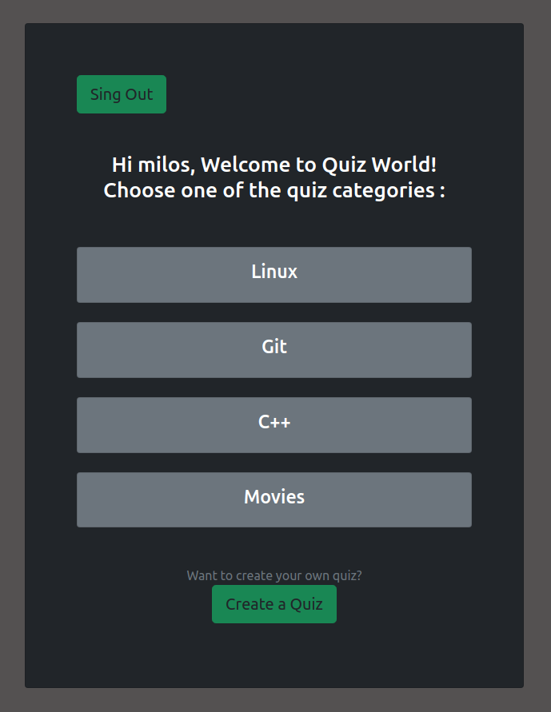
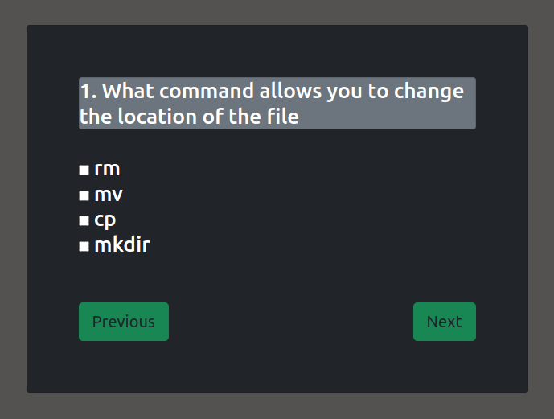
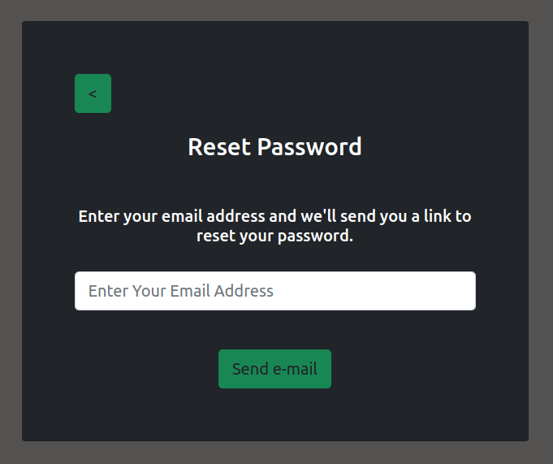

# Django Quiz App

Simple quiz-app built with Django.
## Features

- quizzes and questions CRUD functionality
- validation of  new quizzes/questions by sending email to admins if the user does not have admin status
- user authentication system
- password reset by sending an email with a link
- template-based interface styled with bootstrap
- multiple choice questions
- after the quiz is finished, a summary of the table of top 5 results based on points and time is displayed


## 🛠 Skills

Django , Bootstrap, Javascript


## Screenshots








## Installation

To get this repository, run the following command inside your terminal:

```bash
git clone https://github.com/Milosz-cat/Quiz-App.git
```

Create and start a a virtual environment:

```bash
python -m venv env
```

```bash
source env/bin/activate      # On Windows use `env\Scripts\activate`
```   
Install the project dependencies:
```bash
pip install -r requirements.txt
```   
This will create all the migrations file (database migrations) required to run this project:
```bash
python manage.py makemigrations
```   
Now, to apply this migrations run the following command:
```bash
python manage.py migrate
``` 
Now we need to create admin user:
```bash
python manage.py createsuperuser
``` 


## Environment Variables

To run this project, you will need to add the following environment variables to your .env file

`EMAIL_HOST_USER="enter_your_email@gmail.com`

`EMAIL_HOST_PASSWORD="your_app_password"`

For sending e-mails to work properly on your gamil, you need to go to settings and enable two-step verification and then set a password for the application.
## Start

Finally we can run our local server:

```bash
python manage.py runserver
```

Once the server is hosted, head over to http://127.0.0.1:8000/